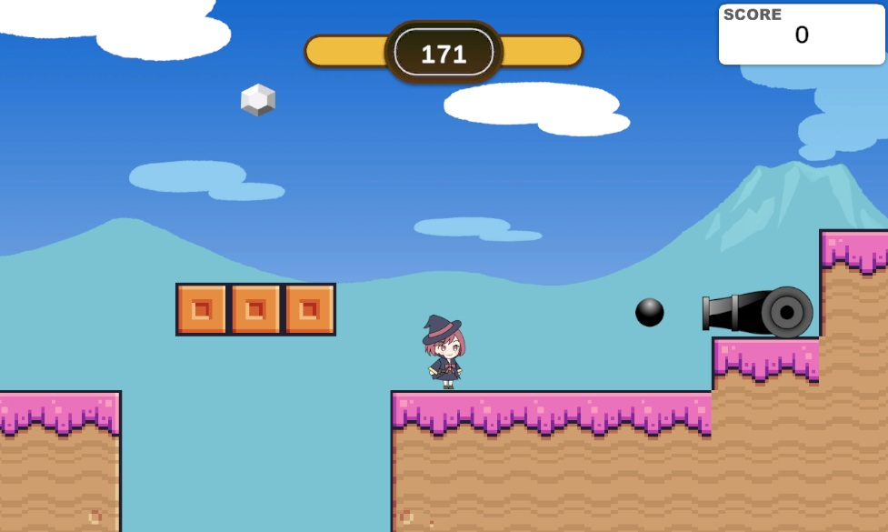
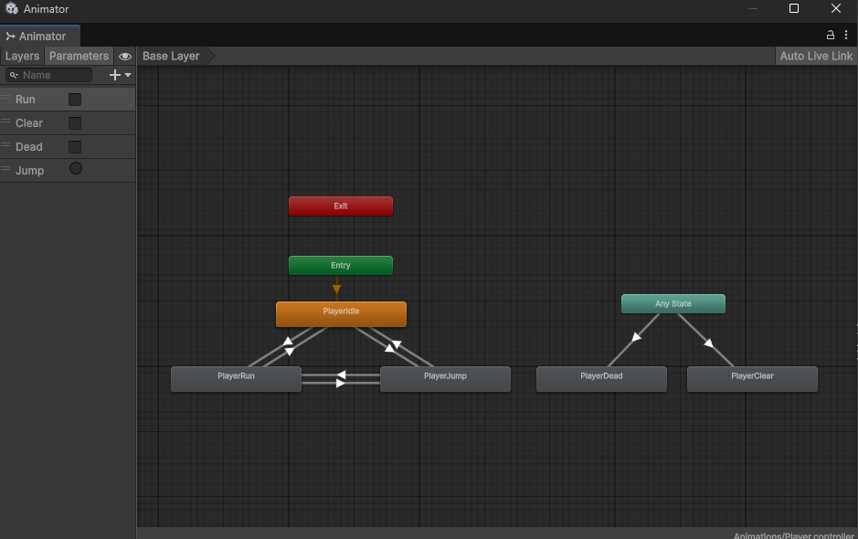
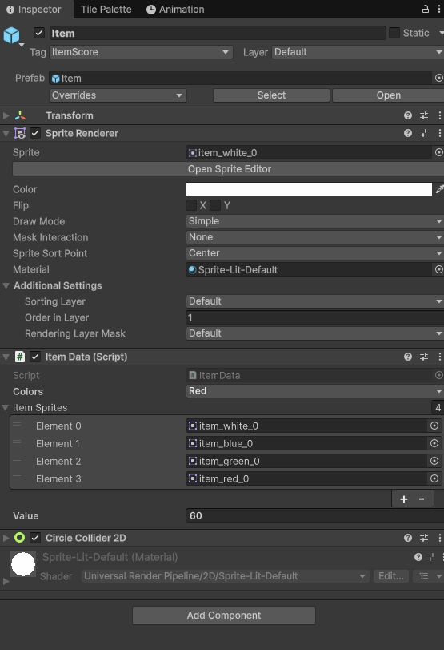

# JewelryHunter_Unity6

[ゲームのサンプルプレイ](https://shunhaku518.github.io/JewelryHunter_Web/)
  

  
## 訓練校で学習する初2D作品
* Playerの動作
* アニメーションの作り方
* タグやレイヤーの使い方
など基本を学んでいます。
  
## 制作のポイント
### アニメーションをトランジションで作成
Playerのアニメ切り替えには各クリップをトランジションで繋いでフラグで管理しました。トランジョンを組み込むことで、アニメ切り替えが滑らかになり、かつコーディングが効率的なものになりました。
  

  
## Itemのコーディングの効率化
Itemは列挙型の
  

  
```
using UnityEngine;

public enum ItemColor
{
    White,
    Blue,
    Green,
    Red
}

public class ItemData : MonoBehaviour
{
    public ItemColor colors = ItemColor.White;
    public Sprite[] itemSprites;

    public int value = 0;       // 整数値を設定できる

    void Start()
    {        
        SpriteRenderer spriteRenderer = GetComponent<SpriteRenderer>();

        switch (colors)
        {
            case ItemColor.White:
                spriteRenderer.sprite = itemSprites[0];
                break;
            case ItemColor.Blue:
                spriteRenderer.sprite = itemSprites[1];
                break;
            case ItemColor.Green:
                spriteRenderer.sprite = itemSprites[2];
                break;
            case ItemColor.Red:
                spriteRenderer.sprite = itemSprites[3];
                break;
        }
    }
}
```

## TextMeshProのデザイン切り分け
TextMeshProのデザインを細かく切り分けてデータを用意するなど工夫しました。
  
